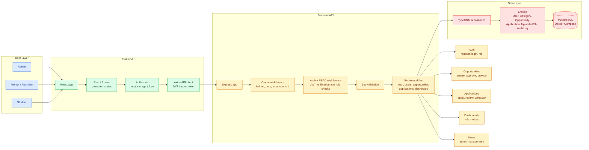

# SkillBridge

SkillBridge is a full-stack, role-based platform for managing academic projects, internships, research tasks, hackathon openings, and collaboration opportunities.

The system replaces scattered opportunity sharing through messages, notice boards, and informal channels with a structured approval, application, and review workflow.

## Project Workflow

| Step | User | Action |
| --- | --- | --- |
| 1 | Mentor / Recruiter | Creates an opportunity listing. |
| 2 | Admin | Approves or rejects the submitted opportunity. |
| 3 | Student | Browses approved and published opportunities. |
| 4 | Student | Applies before the deadline. |
| 5 | Mentor / Recruiter | Reviews applications for owned opportunities. |
| 6 | All roles | Dashboard metrics update based on role-specific activity. |

## User Roles

| Role | Main Capabilities |
| --- | --- |
| Admin | Reviews opportunities, manages users, views applications, and monitors platform metrics. |
| Mentor / Recruiter | Creates opportunities, manages owned listings, and reviews applications for those listings. |
| Student | Browses published opportunities, applies, tracks status, and withdraws applications. |

Public registration supports student and mentor accounts only. Admin accounts are created directly in the database for local development and review.

## Feature Summary

| Area | Implemented Scope |
| --- | --- |
| Authentication | Registration, login, JWT-based sessions, current-user lookup, and persisted frontend auth state. |
| Authorization | Role-based route protection for admin, mentor, and student workflows. |
| Opportunities | Mentor-created listings, admin approval/rejection, published opportunity browsing, and mentor ownership checks. |
| Applications | Student application submission, duplicate prevention, withdrawal, mentor review, and capacity validation. |
| Dashboards | Role-specific metrics for admins, mentors, and students. |
| Admin Tools | Opportunity moderation, user management, and cross-platform application visibility. |
| Frontend UX | Protected routes, role-specific navigation, responsive pages, cards, pagination, and visual dashboard summaries. |
| API Testing | Manual HTTP files covering health, auth, RBAC, opportunities, applications, dashboards, and users. |

## Tech Stack

| Layer | Technologies |
| --- | --- |
| Backend | Node.js, Express, TypeScript, TypeORM, PostgreSQL, JWT, bcryptjs, Zod |
| Frontend | React, TypeScript, Vite, React Router, Axios, Lucide React, CSS |
| Infrastructure | npm, Docker Compose, PostgreSQL 16 |

## Folder Structure

```text
skillBridge/
  README.md
  .gitignore
  docker-compose.yml

  server/
    package.json
    tsconfig.json
    .env.example
    api-tests/
    src/

  client/
    package.json
    vite.config.ts
    index.html
    src/
```

## Architecture



## Environment Variables

Backend variables are documented in `server/.env.example`.

```powershell
cd server
copy .env.example .env
```

Default backend configuration:

```env
NODE_ENV=development
PORT=4000
CLIENT_ORIGIN=http://localhost:5173

DATABASE_HOST=localhost
DATABASE_PORT=5432
DATABASE_USER=postgres
DATABASE_PASSWORD=postgres
DATABASE_NAME=skillbridge
DATABASE_SSL=false
TYPEORM_SYNCHRONIZE=true

JWT_SECRET=replace-this-with-a-long-random-secret
JWT_EXPIRES_IN=1d
```

The frontend uses this API base URL by default:

```env
VITE_API_URL=http://localhost:4000/api
```

## Setup

Run these commands from the `skillBridge/` directory.

| Step | Command |
| --- | --- |
| Install backend dependencies | `cd server`<br>`npm install` |
| Create backend environment file | `copy .env.example .env` |
| Start PostgreSQL | `cd ..`<br>`docker compose up -d postgres` |
| Install frontend dependencies | `cd client`<br>`npm install` |

## Running Locally

Start the backend:

```powershell
cd server
npm run dev
```

Start the frontend in another terminal:

```powershell
cd client
npm run dev
```

Expected local URLs:

| Service | URL |
| --- | --- |
| Frontend | `http://localhost:5173` |
| Backend | `http://localhost:4000` |
| Health check | `http://localhost:4000/health` |
| Readiness check | `http://localhost:4000/ready` |

## Default Admin Account

There is no public admin registration route. For local testing, create an admin account with the SQL block documented in `server/api-tests/rbac.http`.

The manual RBAC fixture uses:

| Field | Value |
| --- | --- |
| Email | `rbac-admin@example.com` |
| Password | `Password123` |

This account is intended for local development and review only.

## API Overview

| Module | Endpoints | Purpose |
| --- | --- | --- |
| Health | `GET /health`<br>`GET /ready` | Checks whether the API is running and whether the database connection is available. |
| Auth | `POST /api/auth/register`<br>`POST /api/auth/login`<br>`GET /api/auth/me`<br>`GET /api/auth/admin-check` | Handles student/mentor registration, login, current-user lookup, and admin access validation. |
| Opportunities | `GET /api/opportunities`<br>`GET /api/opportunities/:id`<br>`POST /api/opportunities`<br>`GET /api/opportunities/mine`<br>`PATCH /api/opportunities/:id`<br>`GET /api/opportunities/admin/review`<br>`POST /api/opportunities/:id/approve`<br>`POST /api/opportunities/:id/reject` | Supports public opportunity browsing, mentor-owned listing management, and admin approval or rejection. |
| Applications | `POST /api/opportunities/:id/apply`<br>`GET /api/applications`<br>`PATCH /api/applications/:id/status`<br>`POST /api/applications/:id/withdraw` | Supports student applications, application tracking, mentor review decisions, and student withdrawal. |
| Dashboard | `GET /api/dashboard` | Returns role-specific dashboard metrics for admins, mentors, and students. |
| Users | `GET /api/users`<br>`PATCH /api/users/:id` | Allows admins to list users and update account status. |

## Main Workflows

| Role | Workflow |
| --- | --- |
| Admin | Log in with a database-created admin account, review dashboard metrics, approve or reject opportunities, manage user status, and view submitted applications. |
| Mentor / Recruiter | Register or log in, create an opportunity, track approval status, review applications for owned listings, and update application status. |
| Student | Register or log in, browse published opportunities, search and filter listings, apply before the deadline, track application status, and withdraw applications when needed. |

## Manual API Tests

Manual backend checks are available in `server/api-tests/*.http`.

| File | Coverage |
| --- | --- |
| `health.http` | Health and readiness endpoints. |
| `auth.http` | Registration, login, and authenticated profile checks. |
| `rbac.http` | Role-based access control and admin fixture setup. |
| `opportunities.http` | Opportunity creation, browsing, review, approval, rejection, and pagination. |
| `applications.http` | Student applications, duplicate checks, withdrawal, and mentor review. |
| `dashboard.http` | Role-specific dashboard metrics. |
| `users.http` | Admin user listing and account status updates. |

## Verification

| Area | Checks |
| --- | --- |
| Backend | `docker compose up -d postgres` starts PostgreSQL.<br>`npm run build` passes from `server/`.<br>`GET /health` returns service status.<br>`GET /ready` confirms database access.<br>JWT and role-protected routes reject unauthorized access.<br>Mentor ownership, duplicate application, and capacity checks work. |
| Frontend | `npm run build` passes from `client/`.<br>`npm run lint` passes from `client/`.<br>Login, registration, protected routing, role navigation, dashboards, pagination, and responsive layouts work. |

## Build Commands

Backend:

```powershell
cd server
npm run build
```

Frontend:

```powershell
cd client
npm run build
npm run lint
```

## Current Version Boundaries

- The project is ready for local demo and review.
- The project is not configured for production deployment.
- The current scope focuses on opportunity approval, applications, role dashboards, and admin management.
- Known gaps are documented below instead of being hidden.

## Known Limitations

- Admin accounts are created manually in the database for local testing.
- Category management UI is not implemented.
- File upload UI and resume attachment workflow are not implemented.
- Password reset and email notification flows are not implemented.
- Production deployment configuration is not included.
- Local TypeORM synchronization is used for development.
- Analytics are limited to dashboard counts and simple visual summaries.
- Manual HTTP files are used instead of a full automated integration test suite.

## Future Improvements

- Add admin category management.
- Add resume and supporting document uploads.
- Add seed scripts for repeatable demo data.
- Add automated backend integration tests.
- Add password reset and email notifications.
- Add an audit log viewer for admins.
- Add richer search and sorting controls.
- Add production deployment configuration.
- Add cloud file storage for uploads.
