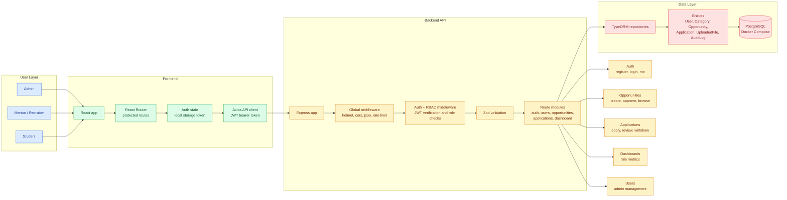

# SkillBridge

SkillBridge is a full-stack role-based project and internship opportunity management platform.

It helps students, mentors, recruiters, and administrators manage academic projects, internships, research tasks, hackathon openings, and collaboration opportunities in one organized place.

## Project Overview

SkillBridge replaces informal opportunity sharing through messages, notice boards, and scattered communication channels with a structured workflow:

```text
Mentor creates opportunity
Admin approves or rejects it
Student browses published opportunities
Student applies before the deadline
Mentor reviews applications
Dashboard metrics update by role
```

## User Roles

- Admin: reviews opportunities, manages users, views all applications, and monitors platform metrics.
- Mentor / Recruiter: creates opportunities, manages their own listings, and reviews applications for their listings.
- Student: browses published opportunities, applies, tracks application status, and withdraws applications.

Public registration supports only student and mentor accounts. Admin accounts must be created directly in the database for local development.

## Features

Backend:

- Express API server with TypeScript.
- PostgreSQL database through Docker Compose.
- TypeORM entities and relationships.
- JWT authentication.
- Password hashing with bcrypt.
- Role-based authorization middleware.
- Opportunity approval workflow.
- Student application workflow.
- Mentor ownership checks.
- Application capacity checks.
- Role-specific dashboard metrics.
- Paginated list endpoints.
- Manual HTTP API tests.

Frontend:

- React + TypeScript + Vite app.
- Login and registration pages.
- Auth state persisted in local storage.
- Protected routes by role.
- Student opportunity browsing and application flow.
- Mentor listings and application review flow.
- Admin approvals and user management flow.
- Role-specific dashboards with metric cards and visual summaries.
- Pagination controls for list pages.
- Responsive card-based UI.

## Tech Stack

Backend:

- Node.js
- Express
- TypeScript
- PostgreSQL
- TypeORM
- JWT
- bcryptjs
- Zod

Frontend:

- React
- TypeScript
- Vite
- React Router
- Axios
- Lucide React
- CSS

Infrastructure:

- npm
- Docker Compose
- PostgreSQL 16

## Folder Structure

```text
skillBridge/
  README.md
  .gitignore
  docker-compose.yml

  server/
    package.json
    tsconfig.json
    .env.example
    api-tests/
    src/

  client/
    package.json
    vite.config.ts
    index.html
    src/
```

Planning and implementation notes live outside the app repo:

```text
app-dev-proj/docs/
app-dev-proj/docs/implementation-log/
```

## Architecture



## Environment Variables

Backend variables are documented in:

```text
server/.env.example
```

Create a local backend env file:

```powershell
copy server\.env.example server\.env
```

Default backend values:

```env
NODE_ENV=development
PORT=4000
CLIENT_ORIGIN=http://localhost:5173

DATABASE_HOST=localhost
DATABASE_PORT=5432
DATABASE_USER=postgres
DATABASE_PASSWORD=postgres
DATABASE_NAME=skillbridge
DATABASE_SSL=false
TYPEORM_SYNCHRONIZE=true

JWT_SECRET=replace-this-with-a-long-random-secret
JWT_EXPIRES_IN=1d
```

Frontend API URL is optional because the app defaults to:

```env
VITE_API_URL=http://localhost:4000/api
```

## Setup Instructions

Run these commands from the `skillBridge/` directory unless a step says otherwise.

Install backend dependencies:

```powershell
cd server
npm install
```

Install frontend dependencies:

```powershell
cd ..\client
npm install
```

Create backend environment file:

```powershell
cd ..\server
copy .env.example .env
```

Start PostgreSQL:

```powershell
cd ..
docker compose up -d postgres
```

## Running the Project

Start the backend:

```powershell
cd server
npm run dev
```

Start the frontend in another terminal:

```powershell
cd client
npm run dev
```

Expected local URLs:

```text
Frontend: http://localhost:5173
Backend:  http://localhost:4000
Health:   http://localhost:4000/health
Ready:    http://localhost:4000/ready
```

## Default Admin Account

There is no public admin registration route. This is intentional.

For local testing, create an admin account with the SQL block documented in:

```text
server/api-tests/rbac.http
```

The manual RBAC fixture uses:

```text
Email:    rbac-admin@example.com
Password: Password123
```

This account is for local development only.

## API Overview

Health:

- `GET /health`
- `GET /ready`

Auth:

- `POST /api/auth/register`
- `POST /api/auth/login`
- `GET /api/auth/me`
- `GET /api/auth/admin-check`

Opportunities:

- `GET /api/opportunities`
- `GET /api/opportunities/:id`
- `POST /api/opportunities`
- `GET /api/opportunities/mine`
- `PATCH /api/opportunities/:id`
- `GET /api/opportunities/admin/review`
- `POST /api/opportunities/:id/approve`
- `POST /api/opportunities/:id/reject`

Applications:

- `POST /api/opportunities/:id/apply`
- `GET /api/applications`
- `PATCH /api/applications/:id/status`
- `POST /api/applications/:id/withdraw`

Dashboard:

- `GET /api/dashboard`

Users:

- `GET /api/users`
- `PATCH /api/users/:id`

## Main Workflows

Admin workflow:

1. Log in with a database-created admin account.
2. Open the dashboard to review platform metrics.
3. Open opportunities to approve or reject pending listings.
4. Open users to activate or suspend accounts.
5. Open applications to view submitted applications across the platform.

Mentor workflow:

1. Register or log in as a mentor.
2. Create an opportunity from the mentor listings page.
3. Track created listings and approval status.
4. Review applications for owned opportunities.
5. Update application status as shortlisted, selected, rejected, waitlisted, or completed.

Student workflow:

1. Register or log in as a student.
2. Browse published opportunities.
3. Search and filter opportunities.
4. Apply before the deadline.
5. Track application status.
6. Withdraw an application when needed.

## Manual API Tests

Manual backend checks live in:

```text
server/api-tests/*.http
```

Files:

- `health.http`
- `auth.http`
- `rbac.http`
- `opportunities.http`
- `applications.http`
- `dashboard.http`
- `users.http`

Use these files to test authentication, authorization, opportunity workflows, application workflows, dashboard metrics, pagination, and admin user management.

## Final Feature Checklist

Completed backend scope:

- Express API server is configured with security, CORS, JSON parsing, rate limiting, and fallback error handling.
- PostgreSQL runs through Docker Compose.
- TypeORM connects to PostgreSQL and manages the core entities.
- User registration supports student and mentor accounts.
- Login returns a JWT for authenticated API access.
- Current-user lookup returns the authenticated user's public profile.
- RBAC middleware protects admin, mentor, and student-only routes.
- Mentors can create opportunities for admin review.
- Mentors can view and edit only their own opportunities.
- Admins can approve or reject opportunities.
- Students can browse only published opportunities.
- Students can apply before the deadline.
- Duplicate student applications are rejected.
- Mentors can review applications for their own opportunities.
- Application status updates enforce opportunity capacity.
- Admin, mentor, and student dashboards return role-specific metrics.
- Opportunity, application, and user list endpoints support pagination.

Completed frontend scope:

- React app runs with Vite.
- Login and registration pages are available.
- Auth state is persisted with a local JWT token.
- Protected routes redirect unauthenticated users.
- Role-specific navigation is shown in the app shell.
- Student users can browse and apply to opportunities.
- Student users can track and withdraw applications.
- Mentor users can create and monitor listings.
- Mentor users can review applications.
- Admin users can review opportunity approvals.
- Admin users can manage account status.
- Dashboard pages show metric cards and simple visual summaries by role.
- List pages use card layouts and pagination controls.
- The UI is responsive for smaller screens.

Current version boundaries:

- The project is ready for local demo and review.
- The project is not configured for production deployment.
- Known gaps are documented below instead of hidden.

## Verification Checklist

Backend:

- `docker compose up -d postgres` starts PostgreSQL.
- `npm run build` passes from `server/`.
- `GET /health` returns the service status.
- `GET /ready` confirms database access.
- Registration and login work.
- JWT-protected routes reject missing and invalid tokens.
- Role-protected routes reject the wrong role.
- Mentor ownership checks work.
- Student duplicate application checks work.
- Capacity validation works when selecting students.

Frontend:

- `npm run build` passes from `client/`.
- `npm run lint` passes from `client/`.
- Login and register pages work.
- Authenticated routes redirect correctly.
- Student browse/apply flow works.
- Mentor listing/review flow works.
- Admin approval/user-management flow works.
- Dashboard metric cards and visual summaries render by role.
- Pagination controls work on list pages.
- Mobile layout remains usable.

## Build Commands

Backend:

```powershell
cd server
npm run build
```

Frontend:

```powershell
cd client
npm run build
npm run lint
```

## Known Limitations

- Admin accounts are created manually in the database for local testing.
- Category management UI is not implemented.
- File upload UI and resume attachment workflow are not implemented.
- No password reset flow.
- No email notifications.
- No production deployment configuration.
- Local TypeORM synchronization is used for development.
- Analytics are limited to dashboard counts and simple visual summaries.
- Manual HTTP files are used instead of an automated integration test suite.

## Future Improvements

- Add admin category management.
- Add resume/supporting document uploads.
- Add seed scripts for repeatable demo data.
- Add automated backend integration tests.
- Add password reset and email notifications.
- Add audit log viewer for admins.
- Add richer search and sorting controls.
- Add production deployment configuration.
- Add cloud file storage for uploads.
