# SkillBridge

SkillBridge is a role-based project and internship opportunity management platform.

## Project Goal

The goal of SkillBridge is to help students, mentors/recruiters, and administrators manage academic projects, internships, research tasks, hackathon openings, and collaboration opportunities in one organized place.

## Roles

- Admin
- Mentor / Recruiter
- Student

## Planned Tech Stack

- React
- Express
- PostgreSQL
- TypeORM
- JWT

## Development Status

This project is being built step by step as a learning-by-doing full-stack application.

## Current Backend Features

- Express API server.
- PostgreSQL database through Docker Compose.
- TypeORM entity models.
- JWT authentication.
- Role-based authorization middleware.
- Manual HTTP API tests.
- Health and readiness checks.

## Backend Architecture

```mermaid
flowchart LR
  subgraph client["Manual and client access"]
    http["auth.http<br/>manual API tests"]
    browser["Browser / future frontend"]
  end

  subgraph server["Server entry"]
    index["index.ts<br/>start backend"]
    app["app.ts<br/>configure Express"]
  end

  subgraph middleware["Global middleware"]
    helmet["helmet"]
    cors["cors"]
    json["express.json"]
    limit["rateLimit"]
  end

  subgraph routes["Routes"]
    healthRoute["health.ts"]
    authRoute["auth.ts"]

    health["GET /health"]
    ready["GET /ready"]
    register["POST /api/auth/register"]
    login["POST /api/auth/login"]
    me["GET /api/auth/me"]
    adminCheck["GET /api/auth/admin-check"]
  end

  subgraph auth["Authentication and authorization"]
    requestUser["Express req.user typing"]
    requireAuth["requireAuth / authenticate"]
    authorize["authorize"]
    permissions["rolePermissions"]
  end

  subgraph utils["Utilities"]
    security["security.ts<br/>password + JWT helpers"]
    sanitize["sanitize.ts<br/>public response shapes"]
  end

  subgraph data["Data access"]
    source["data-source.ts<br/>TypeORM DataSource"]
    repos["TypeORM repositories"]
    entities["entities/*"]
  end

  subgraph db["Database runtime"]
    postgres[("PostgreSQL")]
    compose["docker-compose.yml"]
  end

  http --> app
  browser --> app
  index --> app

  app --> helmet --> cors --> json --> limit
  limit --> healthRoute
  limit --> authRoute

  healthRoute --> health
  healthRoute --> ready
  authRoute --> register
  authRoute --> login
  authRoute --> me
  authRoute --> adminCheck

  me --> requireAuth
  adminCheck --> requireAuth --> authorize --> permissions
  requireAuth --> requestUser

  register --> security
  login --> security
  requireAuth --> security
  register --> sanitize
  login --> sanitize
  me --> sanitize

  ready --> source
  register --> repos
  login --> repos
  requireAuth --> repos
  repos --> source --> entities --> postgres
  compose --> postgres

  classDef clientNode fill:#dbeafe,stroke:#1d4ed8,color:#1e3a8a
  classDef serverNode fill:#dcfce7,stroke:#15803d,color:#14532d
  classDef middlewareNode fill:#fef3c7,stroke:#b45309,color:#78350f
  classDef routeNode fill:#fce7f3,stroke:#be185d,color:#831843
  classDef authNode fill:#f3e8ff,stroke:#7e22ce,color:#581c87
  classDef utilityNode fill:#ccfbf1,stroke:#0f766e,color:#134e4a
  classDef dataNode fill:#fee2e2,stroke:#b91c1c,color:#7f1d1d

  class http,browser clientNode
  class index,app serverNode
  class helmet,cors,json,limit middlewareNode
  class healthRoute,authRoute,health,ready,register,login,me,adminCheck routeNode
  class requestUser,requireAuth,authorize,permissions authNode
  class security,sanitize utilityNode
  class source,repos,entities,postgres,compose dataNode
```



## Backend Setup

Start PostgreSQL from the project root:

```powershell
docker compose up -d postgres
```

Start the backend:

```powershell
cd server
npm run dev
```

Build the backend:

```powershell
cd server
npm run build
```

## Service Checks

Liveness check:

```text
GET http://localhost:4000/health
```

This confirms the Express server is running.

Readiness check:

```text
GET http://localhost:4000/ready
```

This confirms the backend can reach the database.

## Manual API Tests

Manual backend checks live in:

```text
server/api-tests/auth.http
```

Use this file to test:

- Registration.
- Login.
- Current-user lookup.
- Missing and invalid token handling.
- Role-based admin route protection.
